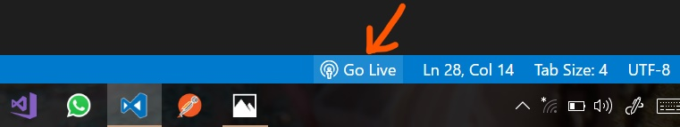

# Visualizing Perlin Noise in 2D Pixel Space

---

## 0. Table of Contents
- [Visualizing Perlin Noise in 2D Pixel Space](#visualizing-perlin-noise-in-2d-pixel-space)
  - [0. Table of Contents](#0-table-of-contents)
  - [1. Introduction](#1-introduction)
    - [1.1. `p5.js`](#11-p5js)
    - [1.2. Random vs. Noise](#12-random-vs-noise)
    - [1.3. Perlin Noise](#13-perlin-noise)
  - [2. Following Along](#2-following-along)
  - [3. References](#3-references)

---

## 1. Introduction

This repository is primarily intended to help me remember how to program an algorithmic system and, hopefully, to pique people's interest in the beauty of creative coding and generative art. All of the simulations and graphics I create have one thing in common. Noise. Perlin noise to be precise. Every line of code uncovers the inherent beauty of pseudo-random numbers, and I can only hope to do it justice by visualizing Perlin noise in 2D space.

### 1.1. `p5.js`

I've developed this project using a JavaScript library named `p5.js`. Renowned for it's open-source and versatile approach to developing interactive graphics, `p5.js` is perfect for visualizing algorithmic systems. Over the years, this library has fostered an amazing and supportive community of creative coding enthusiasts that I'm proud to be a part of. If this is your first time hearing about `p5.js`, I highly urge you to [check out what it has to offer](https://p5js.org/)<sup>[1]</sup>. 

### 1.2. Random vs. Noise

When we speak of algorithmic systems, there is an important distinction to make between noise and randomness. Randomness usually refers to the generation of unpredictable values that do not have a discernible pattern to them. This generation typically leads to an independent value every time. If you have ever used a random number generator, you will know that sometimes you can have sharp changes in the values generated; it's not really smooth. That's where noise comes in, when you want a smoother and more gradual, varying pseudo-random value that does not have as sudden a change as randomness. In addition, neighboring noise values are correlated, meaning they are similar to each other, which results in continuous transitions. This difference is key when we try to simulate organic or natural systems and it can lead to really cool results! 

Note:
When you call `random(2, 3)`, this will give you a random float number between 2 and 3. `random(10)` gives you a random number between 0 and 10. However, you will notice that these values are discernable and independent from one another. If you call `noise(10)` multiple times over, you will get the same number (in the range of 0 to 1) over and over again. `noise(10.001)` will give you a number that is just slightly different from the one before.

Let's simplify and compare `random(1)` and `noise(1)`. With the `random()` function, you have an equal probability of getting any float number between 0 and 1. This means that the distribution is uniform. This is not the case with the `noise()` function, where the distribution is a bell shape (normal distribution) that tends to have it's peak around the mean. Keep in mind, this is only an approximation that makes it easier to think about these functions.

Here's what the noise values look like when called for the same argument. Notice how the noise value marginally changes for a slight change in the input. 


Here's what the random values look like for the same argument.


> It may help to think about the argument to the `noise()` function as a seed value that represents the value on the x-axis that corresponds to a noise value on the distribution's bell curve. The runtime creates a new distribution for the noise values every time you refresh the page. 

### 1.3. Perlin Noise

Perlin Noise, named after Ken Perlin, is one such pseudo-random function that produces values that follow a gradient. It was developed in 1983 to create natural-looking textures and animations and gained fame when used in TRON (1982) for procedurally generating organic, flowing textures for objects. Before then, animators did it all by hand! Perlin was awarded an Oscar for Technical Achievement in 1997, for creating the algorithm that produced never-before seen computer graphics. 

> My ability to fawn over anything *Cyberpunk* never ceases to amaze me so if you were wondering what the inspiration for this project was, there you have it.

This gradient noise function is most commonly applied to 2D and 3D graphics but can be extended to any number of dimensions. For the sake of this simulation, let's leave it at the second dimension. 

The algorithm consists of three steps, regardless of the dimension of the input space: defining a grid of random gradient vectors, computing the dot product between the gradient vectors and their offsets and interpolating between these values<sup>[2]</sup>.

These steps are better represented with these images from Wikipedia.

Step 1, creating a grid of random vectors that have a gradient to them.


Step 2, calculating the dot product between the vectors and the nearest grid node gradient value.


Step 3, interpolating between the dot products produced from step 2.


## 2. Following Along

This repository will start from the bare bones of randomness and noise and will build up to the simulation of Perlin noise in 2D, as we have discussed above. All the scripts/sketches will be annotated and descriptive so feel free to learn or take inspiration from them.

You can run any sketch in this repository with the following steps:

1. Clone this repository with, 
   ```bash
   git clone https://github.com/0xVolt/noisy-pixels.git
   ```

2. For people new to `p5.js`, the easiest way to get it set-up in VSCode is to download [this extension](https://marketplace.visualstudio.com/items?itemName=samplavigne.p5-vscode)<sup>[3]</sup> from the VSCode marketplace. Alternatively you could use the `p5.js` web editor but I find it better to have a local development environment.  

3. The `p5.vscode` extension downloads the live server extension too meaning to run the sketch, you would only need to click the live server button in the bottom-right of your vscode window<sup>[4]</sup>.
   

## 3. References
[1] [The Official p5.js Website](https://p5js.org/)
[2] [Perlin Noise Wikipedia](https://en.wikipedia.org/wiki/Perlin_noise)
[3] [p5.vscode Extension](https://marketplace.visualstudio.com/items?itemName=samplavigne.p5-vscode)
[4] [Live Server Extension](https://marketplace.visualstudio.com/items?itemName=ritwickdey.LiveServer)